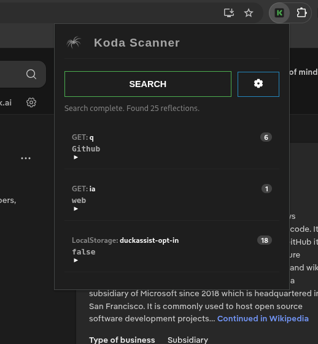

# Koda Scanner

 

 

**Koda Scanner** is a browser extension to instantly discover parameter reflections across web applications. It helps identify potential Cross-Site Scripting (XSS) and injection vulnerabilities by tracking where input parameters are rendered in the DOM.

## 🛠️ How to Install

1. Open **Chrome** and go to `chrome://extensions/`.
2. Enable **Developer mode**.
3. Click **Load unpacked** and select the `src` folder of this project.

## 📝 License

This project is licensed under the [MIT](LICENSE) license.
